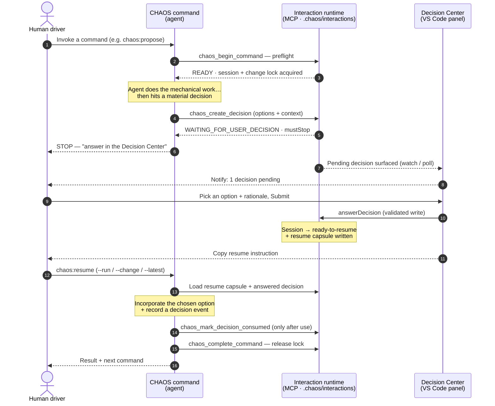

# CHAOS

**Controlled, Human-led, Agent-Orchestrated Software delivery.**

CHAOS is an experimental, opinionated workflow for running an AI-assisted software
development lifecycle where **humans make the decisions and agents do the orchestrated
work** — with every material decision written down, traceable, and reviewable.

It is **not** a universal AI-SDLC framework. It is a specific, human-led governance overlay
for teams that want control and auditability over agent-driven change — whether you're
evolving an existing **brownfield** codebase or starting a new **greenfield** project.

> **Status: experimental / public alpha.** CHAOS is opinionated, still evolving, and not
> production-proven yet. Expect rough edges and incomplete packaging.

## What CHAOS actually is

CHAOS wraps your normal change lifecycle — propose → review → apply → verify → archive — in
a set of governed commands. Each command:

- stops for **material human decisions** instead of guessing;
- records **decision events** with confidence and evidence, so choices aren't lost in chat;
- keeps a **per-change audit trail** under `.chaos/changes/<change-id>/`.

The intent is simple: let agents move fast on the mechanical work, while a human stays in
control of scope, architecture, and risk.

## How the interaction runtime works

Every material decision travels the same loop. The chat thread is **never** the source of
truth — the **interaction runtime** is: a file-backed store under `.chaos/interactions/`,
exposed to the agent over the `chaos-interaction` MCP server. The **Decision Center** (a VS
Code panel) is the human-facing UI onto that same state. This is what keeps a paused run
resumable and every choice auditable.

A few properties fall out of that loop:

- **The change is locked while you decide.** The lock taken at `chaos_create_decision` is
  held until `chaos_complete_command` (or cancel) — not released merely because the decision
  was answered — so no other command can mutate the change mid-decision.
- **Answers are used before they're retired.** The order is always *incorporate → mark
  consumed → complete*; a run never consumes a decision before acting on it, which is what
  lets a resumed run trust the recorded answer.
- **Resume can be automatic.** With `policies.interactionRuntime.autoResume` enabled and a
  live runner (or the in-session Stop hook) driving it, answering in the Decision Center
  continues the **same** session — the manual `chaos:resume` step is skipped. Otherwise the
  session stays `ready-to-resume` for you to resume by hand.

## CHAOS and OpenSpec

If you've never seen either tool:

- **OpenSpec** is the *spec engine*. It owns each change's proposal, design, specs, and tasks
  as the source of truth.
- **CHAOS** is the *governance overlay* on top. It decides when work may proceed, prompts for
  human decisions, records the audit trail, and routes review and verification.

CHAOS **uses** OpenSpec — it does not replace it. A CHAOS proposal is an OpenSpec change with
governance wrapped around it.

## Is CHAOS a fit for you?

**A good fit if you:**

- work on a **brownfield or greenfield** codebase and want agents to help *without* silently
  changing architecture;
- want an explicit, written trail of *why* each change was made;
- are comfortable staying in the loop and answering decision prompts;
- use Claude Code (first-class) or GitHub Copilot (experimental adapter).

**Probably not a fit if you:**

- want a fully autonomous "build it for me" agent with no human gates;
- want a zero-config, universal framework that behaves identically for every stack;
- are prototyping throwaway code where governance overhead isn't worth it;
- need a production-hardened, turnkey product today.

## Maturity & limitations

- **Posture:** public alpha. Core governance and lifecycle commands work; standalone packaging
  (install guide, demo, worked examples) is still in progress.
- **Not production-proven** as a general-purpose tool — treat it as a serious experiment, not
  a finished product.
- **Adapters:** the Claude Code surface is the reference implementation. The **GitHub Copilot
  adapter is experimental** and not yet at parity.
- **Works for brownfield and greenfield**, though its decision-tracking governance is
  especially valuable where existing architecture must be respected.

## Getting started

> These guides are new and still evolving — expect gaps, and see the roadmap for status.

- **Understand it in 5 minutes:** [`docs/overview.md`](docs/overview.md) — the lifecycle,
  commands, modes, and artifact layout on one page.
- **Per-command reference:** [`docs/command-matrix.md`](docs/command-matrix.md) — modes,
  confidence labels, Copilot status, and next-command for every command; plus
  [`docs/command-flags.md`](docs/command-flags.md) for every flag each command accepts.
- **Install & onboarding:** [`docs/installation.md`](docs/installation.md)
- **Worked end-to-end example:** a runnable [`examples/task-tracker/dotnet/`](examples/task-tracker/dotnet/README.md)
  Task API, taken through the lifecycle (propose → review → apply → verify → archive → sync) in
  the [demo walkthrough](docs/demo/README.md) — an illustrative guided tour. For the **real,
  un-retouched trail** of that same change actually executed end-to-end, see the golden demo on the
  [`demo/dotnet` branch](https://github.com/ferreXD/CHAOS/tree/demo/dotnet).
- **Where this is going:** [project roadmap](.chaos/roadmap/roadmap.md)

## Contributing

CHAOS is public alpha and contributions are welcome. Contributing is a normal pull-request
workflow — see [CONTRIBUTING.md](CONTRIBUTING.md) for how to report issues, set up a dev
environment, and open a PR.

## License

See [LICENSE](LICENSE).
