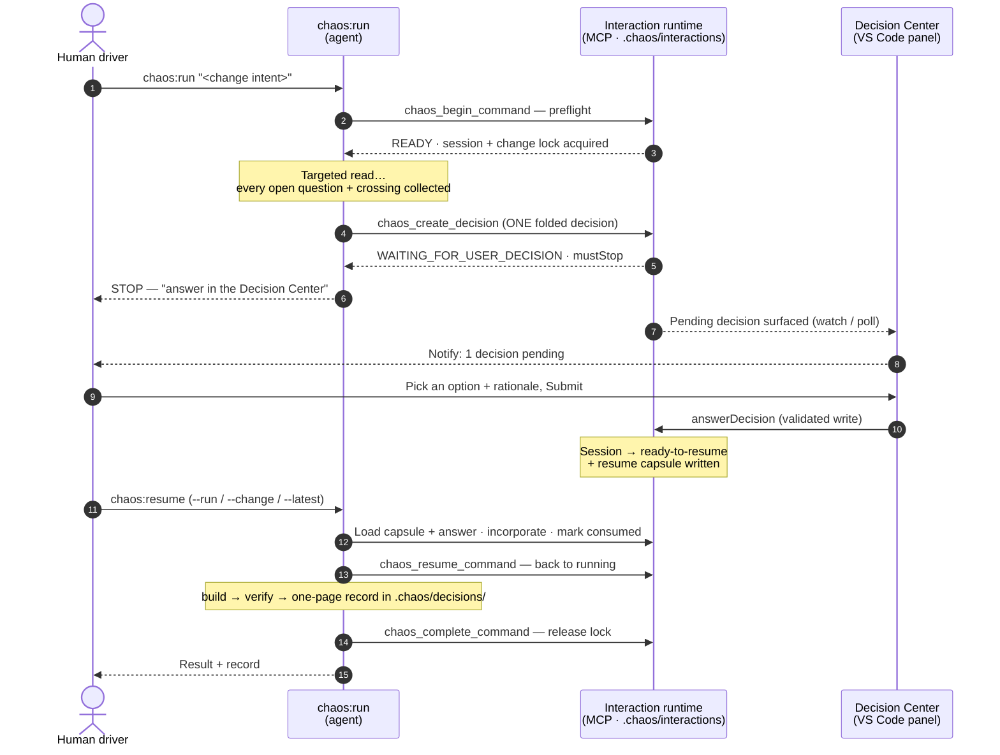

# CHAOS

**Controlled, Human-led, Agent-Orchestrated Software delivery.**

CHAOS is a **thin discipline** for AI-assisted changes: agents do the mechanical work,
and every change passes through **one forced pre-code stop** where a human answers the
open questions, honest verification, and a **decision record**. Nothing more.

It got thin the honest way. A two-month measurement program (T-series on friendly
terrain, then a hostile-terrain program on a real 7-year client codebase) falsified the
heavier apparatus this repo used to carry — full lifecycle commands, classification
machinery, per-phase artifacts — and endorsed exactly three mechanisms. The full record
and verdict live in
[`.chaos/validation/2026-08-hostile-terrain/VERDICT.md`](.chaos/validation/2026-08-hostile-terrain/VERDICT.md);
the retired apparatus is one checkout away at the git tag `apparatus-final`.

> **Status: experimental / public alpha.** Opinionated, evolving, not production-proven.

## The three mechanisms (what survived measurement)

1. **The stop.** Before any code, `chaos:run` folds every open question, doubt,
   assumption, and architecture/contract crossing into a **single decision** answered by
   the human who owns the intent — through the Decision Center, not lost in chat. Every
   real catch the validation program produced came from this.
2. **The verify.** Checks actually run; delegated work gets an independent look;
   anything unverifiable is recorded as a *limit with a reason*, never as a pass.
3. **The record.** One per change in `.chaos/decisions/`, plus owner-confirmed postures in
   `.chaos/architecture.md` and `docs/adr/` — which is what lets a *future* stop catch a
   change that contradicts a recorded decision. Records carry what a future reader needs;
   there is no length limit on them, on the stop, or on anything else CHAOS writes.

## Commands

| Command | What it does |
|---|---|
| `chaos:init` | One-time bootstrap: `AGENTS.md`, `.chaos/` workspace (architecture, decisions, config). |
| `chaos:run "<intent>"` | The core loop: targeted read → pre-code stop → size-gated OpenSpec → build → verify → record. |
| `chaos:resume` | Continue an interrupted run from runtime state + answered decisions — never from chat memory. |
| `chaos:doctor` | Diagnose runtime / MCP / hooks / tooling readiness. Read-only. |
| `chaos:help` | Explain the workflow in-repo. |

## How the interaction runtime works

Every material decision travels the same loop. The chat thread is **never** the source of
truth — the **interaction runtime** is: a file-backed store under `.chaos/interactions/`,
exposed to the agent over the `chaos-interaction` MCP server. The **Decision Center** (a VS
Code panel) is the human-facing UI onto that same state. This is what keeps a paused run
resumable and every choice auditable.

```mermaid
sequenceDiagram
    autonumber
    actor Human as Human driver
    participant Agent as chaos:run<br/>(agent)
    participant Runtime as Interaction runtime<br/>(MCP · .chaos/interactions)
    participant DC as Decision Center<br/>(VS Code panel)

    Human->>Agent: chaos:run "<change intent>"
    Agent->>Runtime: chaos_begin_command — preflight
    Runtime-->>Agent: READY · session + change lock acquired

    Note over Agent: Targeted read…<br/>every open question + crossing collected

    Agent->>Runtime: chaos_create_decision (ONE folded decision)
    Runtime-->>Agent: WAITING_FOR_USER_DECISION · mustStop
    Agent-->>Human: STOP — "answer in the Decision Center"

    Runtime-->>DC: Pending decision surfaced (watch / poll)
    DC-->>Human: Notify: 1 decision pending
    Human->>DC: Pick an option + rationale, Submit
    DC->>Runtime: answerDecision (validated write)
    Note over Runtime: Session → ready-to-resume<br/>+ resume capsule written

    Human->>Agent: chaos:resume (--run / --change / --latest)
    Agent->>Runtime: Load capsule + answer · incorporate · mark consumed
    Agent->>Runtime: chaos_resume_command — back to running
    Note over Agent: build → verify → one-page record in .chaos/decisions/
    Agent->>Runtime: chaos_complete_command — release lock
    Agent-->>Human: Result + record
```

A few properties fall out of that loop:

- **The change is locked while you decide.** The lock taken at `chaos_create_decision` is
  held until `chaos_complete_command` (or cancel), so no other command can mutate the
  change mid-decision.
- **Answers are used before they're retired.** Always *incorporate → mark consumed →
  resume*; a run never consumes a decision before acting on it, and never re-asks a
  question the runtime already holds an answer for.
- **Resume never comes from chat memory.** The capsule and the answered decisions are the
  entire handoff.

## CHAOS and OpenSpec

**OpenSpec** is the spec engine; CHAOS invokes it **when the change is big enough to
deserve a spec**. The gate is deterministic and shown at the stop: estimated ≥5 files or
≥250 LOC or any posture crossing → an OpenSpec change is owed; smaller → optional, and the
human can flip it either way. Thresholds live in `.chaos/config.yaml` (`specGate:`).

## Is CHAOS a fit for you?

**A good fit if you:**

- want agents to move fast *without* silently changing architecture or contracts;
- want a written trail of *why* each change was made, at one page per change;
- are comfortable answering one decision prompt per change;
- use Claude Code (first-class).

**Probably not a fit if you:**

- want a fully autonomous "build it for me" agent with no human gate;
- are prototyping throwaway code where even one stop isn't worth it.

## Maturity, history & docs

- Public alpha. The lean core is new (2026-08); the runtime + Decision Center underneath
  it are the most exercised parts of the codebase (abuse-tested, live-validated).
- The guides under [`docs/`](docs/) (overview, command matrix, installation, demo) still
  describe the **retired full lifecycle** and are pending rewrite — for the current
  workflow, `chaos:help` and [`.claude/skills/chaos-run/SKILL.md`](.claude/skills/chaos-run/SKILL.md)
  are authoritative. The measurement series that produced the lean core is under
  [`.chaos/validation/`](.chaos/validation/).

## Contributing

Contributions are welcome — a normal pull-request workflow; see
[CONTRIBUTING.md](CONTRIBUTING.md).

## License

See [LICENSE](LICENSE).
